# EV Saarthi - Project Synopsis

## 🎯 Goal

To develop a comprehensive web-based Electric Vehicle Management Platform that addresses critical challenges faced by EV users in India by eliminating range anxiety, providing reliable charging infrastructure information, and creating a unified ecosystem that supports EV adoption and enhances the ownership experience.

---

## 📱 What It Does

**EV Saarthi** is an intelligent platform that serves as a complete companion for electric vehicle owners and prospective buyers in India. The platform combines community-driven data, artificial intelligence, and user-centric design to provide:

- **Real-time Charging Infrastructure Visibility**: Locate charging stations across India with community-verified status updates, pricing, and amenities
- **Intelligent Trip Planning**: Plan long-distance journeys with AI-powered range predictions accounting for Indian weather, terrain, traffic, and vehicle characteristics
- **Cost Transparency**: Track charging expenses, compare savings vs conventional vehicles, and calculate government subsidies (FAME-II)
- **Community Knowledge Sharing**: Access verified reviews, photos, real-time updates, and discussions from fellow EV owners
- **AI-Powered Assistance**: Get 24/7 support through an intelligent chatbot in both Hindi and English
- **Comprehensive Analytics**: Monitor usage patterns, efficiency metrics, and environmental impact

---

## ⚡ Main Features

### 1. **Intelligent Charging Station Finder**
- Interactive map displaying charging stations across India
- Advanced filters: connector type (Bharat AC-001, CCS2, CHAdeMO, Type 2), charging speed, network (Tata Power, Ather Grid, Statiq)
- Community-verified real-time status updates
- Pricing information, payment methods (UPI support), amenities
- Safety ratings for secure charging locations

### 2. **AI-Powered Trip Planner**
- Realistic range prediction based on:
  - Weather conditions (5°C to 45°C temperature variations)
  - Terrain analysis (elevation gain/loss)
  - Traffic patterns (city vs highway efficiency)
  - Individual driving style
  - Vehicle-specific characteristics
- Optimal charging stop recommendations
- Confidence intervals and safety buffers
- Continuous learning from real-world trip data

### 3. **Cost Tracker & Savings Calculator**
- Comprehensive charging session logging
- Monthly/yearly cost breakdowns (home vs public charging)
- Comparison with petrol/diesel vehicle costs
- FAME-II subsidy calculator
- State-specific incentive information
- Total cost of ownership analysis

### 4. **Community Hub**
- Detailed charging station reviews and ratings
- Photo uploads for visual verification
- Real-time status updates from users
- Discussion forums by topic and vehicle model
- Gamification with points, badges, and leaderboards
- Trusted contributor system

### 5. **EV Knowledge Hub**
- Vehicle buying guides and model comparisons
- Subsidy and incentive information (FAME-II, state benefits)
- Home charging installation guidance
- Best practices for Indian conditions (extreme weather, terrain)
- Service center locations and maintenance schedules
- Finance and insurance guides

### 6. **Analytics Dashboard**
- Usage metrics: distance traveled, energy consumed, efficiency (km/kWh)
- Cost breakdown visualizations
- Environmental impact tracking (CO₂ emissions avoided)
- Comparative analysis with other users
- Goal setting and budget tracking

### 7. **AI Chatbot Assistant** (Hindi & English)
- 24/7 virtual assistance for queries
- Vehicle recommendations based on needs assessment
- Subsidy calculation assistance
- Troubleshooting support
- Context-aware personalized responses

### 8. **Intelligent Route Planning AI**
- Multi-factor range analysis
- Machine learning-based predictions
- Charging stop optimization
- Safety buffers and confidence levels
- Adaptation to individual driving patterns

---

## 🔬 Methodology

### **Development Approach**

#### **Phase 1: Foundation & Core Features (Weeks 1-4)**
- Set up web application framework, database, and cloud infrastructure
- Implement authentication system (phone/OTP, email, social login)
- Aggregate initial charging station database from public sources
- Build basic map interface with search and filter functionality
- Establish third-party integrations (mapping, weather APIs)

#### **Phase 2: User Features & Community (Weeks 5-6)**
- Develop vehicle management interface
- Implement charging session logging system
- Build review and rating system with photo uploads
- Create analytics dashboard and cost tracking
- Develop savings calculator and comparisons

#### **Phase 3: AI Integration (Weeks 7-8)**
- Deploy AI chatbot with Hindi and English support
- Implement rule-based route planning with range prediction
- Integrate weather and elevation data
- Train chatbot on Indian EV knowledge base
- Testing and refinement of AI responses

#### **Phase 4: Polish & Launch (Weeks 9-10)**
- Mobile-first UI optimization and responsiveness
- Performance optimization for slower networks
- Complete Hindi language implementation
- Populate knowledge hub with comprehensive content
- Security audits and testing
- Prepare marketing materials

### **Technical Architecture**

- **Platform**: Web-based application (Progressive Web App)
- **Infrastructure**: Cloud-hosted with auto-scaling capabilities
- **Database**: Structured database for users, vehicles, sessions, reviews, and station data
- **Security**: Encryption at rest and in transit, secure authentication
- **Third-Party Services**: 
  - Mapping and routing services
  - Weather forecasting APIs
  - AI/NLP services for chatbot
  - SMS/Email services for authentication
- **Mobile**: Responsive design, offline capability for critical features

### **Data Collection Strategy**

- **Crowd-Sourcing**: Community-driven station status updates and reviews
- **Public APIs**: Initial station data from Open Charge Map and network APIs
- **User Logging**: Charging sessions and trip data for AI model training
- **Machine Learning**: Continuous improvement of range predictions from real-world data

### **Multi-Language Support**

- Bilingual interface (Hindi and English)
- Natural language processing for chatbot in both languages
- Culturally appropriate content and design elements

---

## 📊 Methodology Flowchart

---

## 🔄 User Journey Flowchart

```mermaid
flowchart TD
    User([EV User]) --> Register[Register/Login]
    
    Register --> Dashboard[User Dashboard]
    
    Dashboard --> Feature1[Charging Station Finder]
    Dashboard --> Feature2[Trip Planner]
    Dashboard --> Feature3[Cost Tracker]
    Dashboard --> Feature4[Community Hub]
    Dashboard --> Feature5[Knowledge Hub]
    Dashboard --> Feature6[AI Chatbot]
    
    Feature1 --> F1_1[Search Stations]
    F1_1 --> F1_2[View Details]
    F1_2 --> F1_3[Check Community Reviews]
    F1_3 --> F1_4[Navigate to Station]
    F1_4 --> F1_5[Contribute Review/Photo]
    F1_5 --> Community[(Community Data)]
    
    Feature2 --> F2_1[Enter Trip Details]
    F2_1 --> F2_2[AI Range Prediction]
    F2_2 --> F2_3[Weather & Terrain Analysis]
    F2_3 --> F2_4[Optimal Charging Stops]
    F2_4 --> F2_5[Save/Start Trip]
    F2_5 --> F2_6[Log Trip Completion]
    F2_6 --> ML[(ML Model Training)]
    
    Feature3 --> F3_1[Log Charging Session]
    F3_1 --> F3_2[View Cost Analysis]
    F3_2 --> F3_3[Compare with ICE]
    F3_3 --> F3_4[Track Savings]
    
    Feature4 --> F4_1[Browse Reviews]
    Feature4 --> F4_2[Join Discussions]
    Feature4 --> F4_3[Upload Photos]
    Feature4 --> F4_4[Report Station Status]
    F4_1 --> Community
    F4_2 --> Community
    F4_3 --> Community
    F4_4 --> Community
    
    Feature5 --> F5_1[Read Buying Guides]
    Feature5 --> F5_2[Calculate Subsidies]
    Feature5 --> F5_3[Learn Best Practices]
    
    Feature6 --> F6_1[Ask Question<br/>Hindi/English]
    F6_1 --> F6_2[AI Response]
    F6_2 --> F6_3[Get Vehicle Recommendation]
    F6_2 --> F6_4[Subsidy Calculation Help]
    F6_2 --> F6_5[Troubleshooting]
    
    Community --> Improve[Platform Improvement]
    ML --> Improve
    Improve --> Dashboard
    
    style User fill:#4a90e2,color:#fff
    style Dashboard fill:#7ed321
    style Community fill:#f5a623
    style ML fill:#bd10e0,color:#fff
    style Improve fill:#50e3c2
```

---

## 📈 Success Metrics

### **3-Month Targets**
- Registered users: 500-2,000
- Daily active users: 50-100
- Community reviews: 200+

### **6-Month Targets**
- Registered users: 5,000-10,000
- Daily active users: 500-800
- 70% of stations with reviews
- ML model deployed for route planning

### **12-Month Targets**
- Registered users: 25,000-50,000
- Daily active users: 2,000-4,000
- Revenue generation through premium features
- Break-even milestone

---

## 💰 Budget Overview

**First Year Investment**: ₹1,50,000 - ₹3,50,000

- **Development Phase**: ₹50,000-₹1,50,000
- **Operational Costs**: ₹24,000-₹72,000
- **Marketing**: ₹60,000-₹1,20,000

**Monthly Operating Costs**: ₹2,000-₹6,000
- Hosting & infrastructure
- API services (mapping, weather, AI)
- Communication (SMS/Email)

---

## 🚀 Competitive Advantages

1. **India-Specific Focus**: Designed for Indian conditions (weather, terrain, languages)
2. **Community-Driven**: Real-world data more reliable than official sources
3. **Multi-Network**: Supports all charging networks vs siloed apps
4. **AI-Powered**: Intelligent assistance and realistic range predictions
5. **Bilingual**: Hindi and English support for wider accessibility
6. **Comprehensive**: All-in-one platform vs fragmented solutions

---

**Project Timeline**: 10 weeks to MVP launch  
**Target Launch**: Q2 2026  
**Platform**: Web-based (Progressive Web App)  
**Languages**: Hindi & English  
**Target Market**: 2.5M+ EV owners in India (growing to 10M by 2030)
